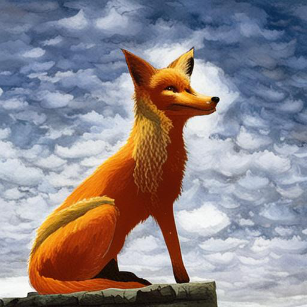

# Задание

Implement a program for applying filters to your images. Possible filters: blur, edge detection, denoising. Implement three versions of the program, namely, using global, shared memory and texture. Compare the time. To work with image files, it is recommended to use libpng (man libpng).

# Результат

Среднее время работы разных сверток (Гауссово размытие):
| memory type | mean elapsed time, ms |
| ------------| ----------------------|
| global      | 0.0842                |
| shared      | 0.0595                |
| texture     | 0.0713                |

Как видно, свертка с использованием разделяемой памяти показала наилучший результат.

# Картинки

